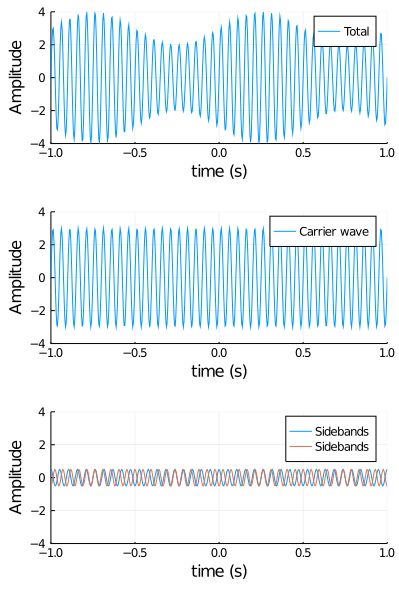

# Week 1 Programming parts

```julia
using Plots
```

## Section III
### Problem 8

Composite type to hold the variable information for AM radio wave

```julia
struct AMradio{T}
    A::T
    B::T
    f::T
    fc::T
    v::T
end
```

Evaluates the am radio waves profile

```julia
function (am::AMradio{T})(x,t) where {T}
    carrier_amp = am.A + am.B*sin(2π*am.f*t)
    carrier = sin(2π*am.fc*(t-x/am.v))

    return carrier_amp*carrier
end
```

Finds the carrier wave for the am radio wave.

```julia
function carrier(am::AMradio{T}, x::T, t::T) where {T}
    return am.A*sin(2π*am.fc*(t-x/am.v))
end
```

```
carrier (generic function with 1 method)
```

Finds the two side bands for the radio wave am.

```julia
function sidebands(am::AMradio{T}, x::T, t::T) where {T}
    arg1 = 2π*(am.f - am.fc)*t
    arg2 = 2π*(am.f + am.fc)*t
    phase = 2π*am.fc*x/am.v + π/2

    return (am.B*sin(arg1 + phase)/2.0, am.B*sin(arg2 - phase)/2.0)
end
```

```
sidebands (generic function with 1 method)
```

Create our test radio wave and plot it

```julia
const test = AMradio(3.0,1.0,1.0,20.0,1.0)

a = plot(t->test(1.0,t), label="Total", ylims=(-4.0,4.0))
b = plot(t->carrier(test, 1.0, t), label="Carrier wave", ylims=(-4.0,4.0))
c = plot(t->sidebands(test, 1.0, t)[1], label="Sidebands", ylims=(-4.0,4.0))
c = plot!(t->sidebands(test, 1.0, t)[2], label="Sidebands", ylims=(-4.0,4.0))
plot(a,b,c, layout=(3,1), size=(400,600))
xlabel!("time (s)")
ylabel!("Amplitude")
xlims!(-1.0,1.0)
```


---

*This page was generated using [Literate.jl](https://github.com/fredrikekre/Literate.jl).*

